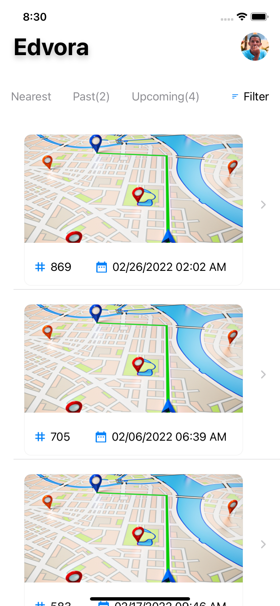
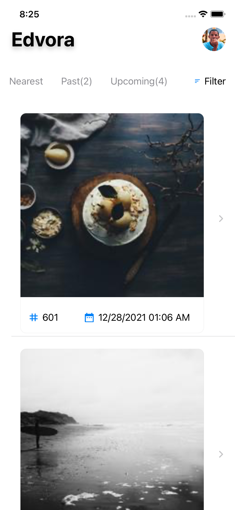
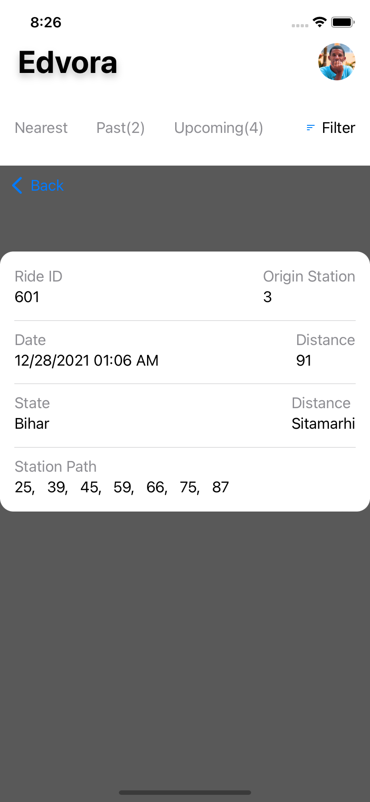
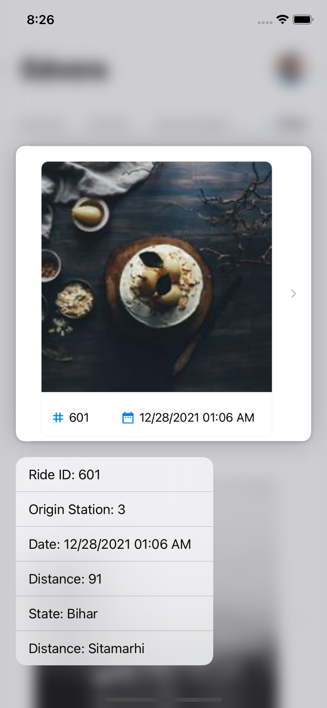
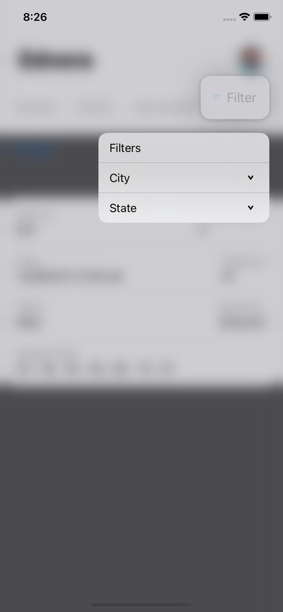
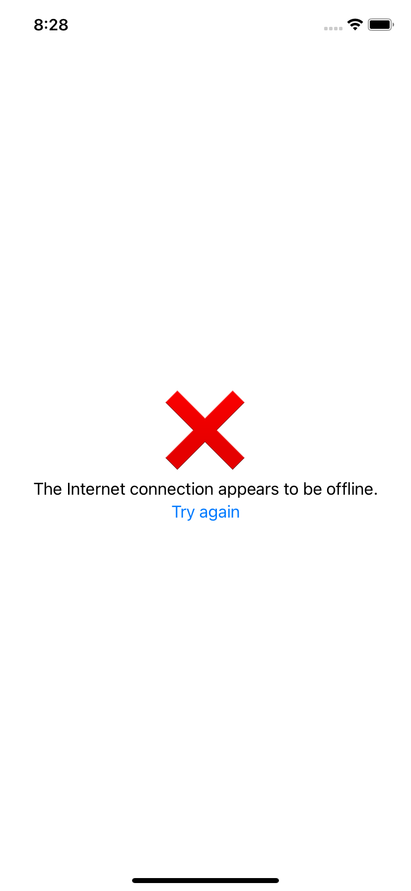

# Edvora_Task

In this app: 

- Connected the API and displays a list of rides and users.
- The rides and users are displayed using list in swiftUI .
- When a ride is selected, a new ride details view should be displayed using context menu in swiftui.
- Applied the concept of cashing. 
- Wrote the unit test cases.

What makes this app unique? 

- Created it and implemented all the project using swiftUI.  
- Add filter feature.
- Used combine library 
- Open to anyone to learn the concept of cashing (How make your app interact when internet connection is on or off)

### Which design pattern I used?

The MVVM pattern consists of three layers:
- Model: App data that the app operates on.
- View: The user interface’s visual elements. In iOS, the view controller is inseparable from the concept of the view.
- ViewModel: Updates the model from view inputs and updates views from model outputs.

#### Why?

MVVM offers some advantages over MVC:
- MVVM makes the view controller simpler by moving a lot of business logic out of it.
- The view model better expresses the business logic for the view.
- A view model is much easier to test than a view controller. You end up testing business logic without having to worry about view implementations.

## The App has 4 main pages and 3 features:

[1] Home Ride page with internet connection. 

[2] Home Ride page without internet connection.

[2] Rides Details page.

[3] Ride context menu feature. 

[4] Loading page.

[5] Filter feature.

[6] Error page when there is no internet connection.

## Loading page

   

## Home Ride page without internet connection

  

## Home Ride page with internet connection

  

## Rides Details page

  

## Ride context menu feature

  

## Filter feature

  

## Error page when there is no internet connection

  

